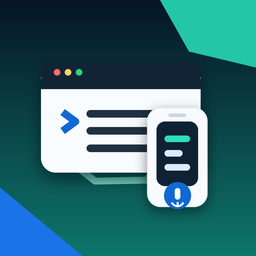
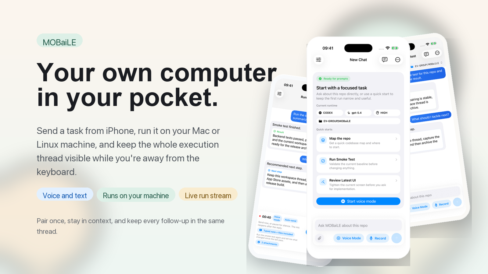
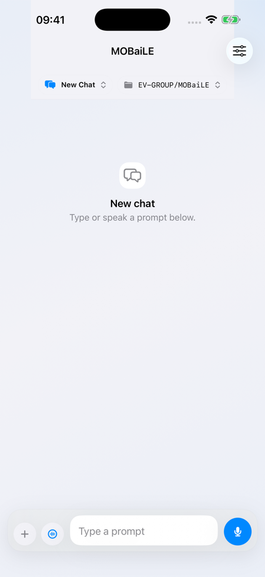
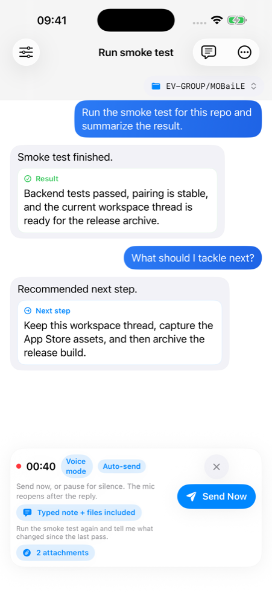

# MOBaiLE

<p align="center">
  
</p>

<p align="center"><strong>Your own computer, in your pocket.</strong></p>

<p align="center">
  Start a task from iPhone, run it on your own Mac or Linux machine, and keep the whole execution thread visible while you are away from the keyboard.
</p>

<p align="center">
  MOBaiLE is the handheld control surface. Your computer does the work with your real repo, CLI tools, auth, files, and network.
  This repo contains both the iPhone app and the computer-side setup if you want to build or self-host it.
</p>

<p align="center">
  <a href="docs/USAGE.md"><strong>Install Guide</strong></a>
  ·
  <a href="backend/README.md"><strong>Backend</strong></a>
  ·
  <a href="ios/README.md"><strong>iPhone App</strong></a>
  ·
  <a href="ARCHITECTURE.md"><strong>Architecture</strong></a>
  ·
  <a href="scripts/README.md"><strong>Scripts</strong></a>
</p>

> The phone starts and follows the run. Your Mac or Linux machine does the work.

## Install on the computer you want to control

```bash
curl -fsSL https://raw.githubusercontent.com/vemundss/MOBaiLE/main/scripts/install.sh | bash
```

If you want the shortest path, do this:

1. Run the installer on the Mac or Linux machine you want MOBaiLE to use.
2. Keep the defaults: `Full Access`, `Anywhere with Tailscale`, and usually `Yes` for the background service.
3. When the installer shows the pairing QR, open MOBaiLE on your iPhone and tap `Scan Pairing QR`.
4. Point the phone at the screen, confirm the pairing, and send a small prompt.
5. Later, run `mobaile status` any time to check that the computer is ready. If your shell does not find it yet, run `~/.local/bin/mobaile status`.

When you want the latest installed CLI/backend later, run `mobaile update`.

`install.sh` installs or updates MOBaiLE in `~/MOBaiLE`, configures the backend, creates the pairing QR, keeps the service running in the background when supported, and installs the `mobaile` command for status, pairing, and logs.

Need the longer setup and operations path? Start with [`docs/USAGE.md`](docs/USAGE.md).

<p align="center">
  
</p>

## Why people reach for it

- **It uses your real machine.** Work against your actual repo, shell, auth, files, and network instead of moving everything into a separate hosted environment.
- **It keeps the run readable.** Prompt, live progress, result, and follow-up stay in one thread instead of collapsing into a final notification.
- **It works when the laptop is the inconvenient device.** Voice mode, silence-based send, widgets, haptics, audio cues, and Shortcuts make it usable while walking, commuting, or away from the desk.
- **It preserves momentum.** Pair once, stay in the same workspace thread, and keep the next step grounded in what just happened.

## Keep trust boundaries explicit

- **The phone does not run the code.** It sends prompts, audio, attachments, and session metadata to the backend you control.
- **Security mode stays visible.** Use `safe` on a cautious host, or `full-access` on a trusted private machine.
- **Pairing is deliberate.** MOBaiLE uses a pairing QR and one-time `pair_code`; the long-lived API token stays on the host.
- **The network path is inspectable.** Pairing prefers Tailscale or configured public URLs, and the backend remains yours to operate.

## Three moments that matter

<p align="center">
  
  
  
</p>

- **Start in the right workspace.** See the paired runtime, working directory, and quick starts before you send the first prompt.
- **Follow the run live.** Result, summary, and next recommended action stay together in the same thread.
- **Keep talking without losing context.** Voice mode reopens the mic after each reply, while attachments and typed follow-ups stay in the same conversation.

## Good First Prompts

- `create a hello python script and run it`
- `inspect this repo and tell me where onboarding feels rough`
- `check my calendar today and summarize conflicts`
- `fix the failing test and explain the patch`

<details>
  <summary><strong>Other setup paths</strong></summary>

Use these only if the main install command is not what you want.

- Already in a checkout and want to run the installer there: `bash ./scripts/install.sh`
- Backend-only/manual path from a checkout: `bash ./scripts/install_backend.sh --mode full-access --phone-access tailscale`
- Local simulator-only testing: `bash ./scripts/install_backend.sh --mode safe --phone-access local`

If you skip QR pairing, the app can also be connected manually with a reachable server address and API token.

</details>

<details>
  <summary><strong>Full setup details</strong></summary>

### Install the essentials

On your computer:

- `git`, `python3`, `curl`
- [`uv`](https://docs.astral.sh/uv/) if you are not letting the install scripts add it for you
- [Tailscale](https://tailscale.com/download)

On your iPhone:

- **Tailscale**
- **MOBaiLE**, from TestFlight or the App Store, or built locally from `ios/`

MOBaiLE never runs code on the phone. It only sends prompts, audio, attachments, and session metadata to the backend you pair with.

### Sign in to Tailscale on both devices

Use the same tailnet on both devices. On the computer:

```bash
tailscale status
tailscale ip -4
```

### Install on the computer

Recommended path:

```bash
curl -fsSL https://raw.githubusercontent.com/vemundss/MOBaiLE/main/scripts/install.sh | bash
```

If you are already in a checkout:

```bash
bash ./scripts/install.sh --checkout "$PWD"
```

The installer asks three questions:

1. How much access should MOBaiLE have on this computer?
   Keep `Full Access` unless you specifically want the safer mode.
2. Where should your phone work?
   Keep `Anywhere with Tailscale` for the normal remote setup.
3. Should MOBaiLE stay running in the background?
   Keep `Yes` if this computer should stay ready for the phone.

Manual host-only path from a checkout:

```bash
bash ./scripts/install_backend.sh --mode full-access --phone-access tailscale
bash ./scripts/service_macos.sh install   # macOS
# or on Linux:
bash ./scripts/service_linux.sh install
bash ./scripts/pairing_qr.sh
```

What the installer does:

- installs backend dependencies and creates `backend/.env`
- creates `backend/pairing.json` using a Tailscale URL when available
- installs and starts a background service on macOS or Linux when supported
- generates `backend/pairing-qr.png`

If you want a stable hostname for the iPhone, set `VOICE_AGENT_PUBLIC_SERVER_URL` before pairing. Otherwise MOBaiLE prefers the Tailscale or LAN URLs advertised in `backend/pairing.json`.

### Check that the computer is ready

```bash
curl http://127.0.0.1:8000/health
```

Expected result: JSON with status `ok`.

### Pair the phone

On the computer:

1. Open `backend/pairing-qr.png`.
2. If it is missing, regenerate it:

```bash
bash ./scripts/pairing_qr.sh
```

On the iPhone:

1. Tap `Scan Pairing QR` inside MOBaiLE.
2. Point the phone at the QR on your computer.
3. Confirm pairing inside MOBaiLE.

Manual fallback in app settings:

- `Server URL`: preferred URL from `backend/pairing.json`
- `API Token`: `VOICE_AGENT_API_TOKEN` from `backend/.env`
- `Session ID`: keep `iphone-app` unless you want a custom one

If the app works on Wi-Fi but not on cellular, verify the chosen Tailscale or public URL is reachable from the phone.

### Validate remote use

1. Turn off Wi-Fi on the iPhone.
2. Keep Tailscale connected.
3. Send a small prompt such as `create and run a hello script`.
4. Confirm live events and the final result both come back in the thread.

</details>

## Designed For On-The-Go Use

- **Widget:** add `Start Voice Task` to jump straight into recording from the Home Screen.
- **Haptic and audio cues:** useful when you do not want to stare at the screen for confirmation.
- **Voice mode:** keeps the mic reopening after each reply so the conversation can continue hands-free.
- **Auto-send after silence:** ideal for shorter one-shot voice captures.
- **Siri and Shortcuts:** available intents include `Start Voice Mode` and `Send Last Prompt`.

## Developer Commands

Common maintenance commands:

```bash
bash ./scripts/doctor.sh
bash ./scripts/pairing_qr.sh
cd backend && bash ./run_backend.sh
cd backend && uv run pytest -q
cd backend && uv run python ../scripts/sync_contracts.py --check
```

Service control:

```bash
# macOS
bash ./scripts/service_macos.sh status
bash ./scripts/service_macos.sh restart
bash ./scripts/service_macos.sh logs

# Linux
bash ./scripts/service_linux.sh status
bash ./scripts/service_linux.sh restart
bash ./scripts/service_linux.sh logs
```

Optional npm wrappers:

```bash
npm run setup:server
npm run backend:start
npm run doctor
npm run pair:qr
npm run ios:open
```

Optional commit-time secret scanning:

```bash
uv tool install pre-commit
pre-commit install
pre-commit run --all-files
```

## Troubleshooting

<details>
  <summary><strong>Common fixes</strong></summary>

- Pairing QR contains `127.0.0.1` instead of a Tailscale or LAN URL:

```bash
bash ./scripts/install_backend.sh --mode full-access --phone-access tailscale
bash ./scripts/pairing_qr.sh
```

- iPhone can pair on Wi-Fi but not on cellular:
  - confirm Tailscale is connected on both devices
  - confirm the backend is still running with `bash ./scripts/doctor.sh`

- Voice works for text but not the mic:
  - enable `Speech Recognition` for MOBaiLE in iOS Settings
  - on a real iPhone, MOBaiLE transcribes locally first, and `OPENAI_API_KEY` is only needed for backend audio-upload fallback

- Backend audio uploads fail:
  - set `OPENAI_API_KEY` in `backend/.env`
  - text prompts still work without it, but `/v1/audio` depends on backend transcription

</details>

## More Docs

- Usage guide: [`docs/USAGE.md`](docs/USAGE.md)
- Backend details and endpoints: [`backend/README.md`](backend/README.md)
- iPhone details: [`ios/README.md`](ios/README.md)
- Scripts reference: [`scripts/README.md`](scripts/README.md)
- Architecture: [`ARCHITECTURE.md`](ARCHITECTURE.md)
- Documentation policy: [`docs/POLICY.md`](docs/POLICY.md)
- Public pages and App Store URLs: [`docs/PUBLIC_PAGES.md`](docs/PUBLIC_PAGES.md)
- App Store copy: [`docs/APP_STORE_COPY.md`](docs/APP_STORE_COPY.md)
- Contributing: [`CONTRIBUTING.md`](CONTRIBUTING.md)
- Security policy: [`SECURITY.md`](SECURITY.md)
- Code of conduct: [`CODE_OF_CONDUCT.md`](CODE_OF_CONDUCT.md)

## License

This project is licensed under the Apache License, Version 2.0.
See [`LICENSE`](LICENSE) for the full text.
