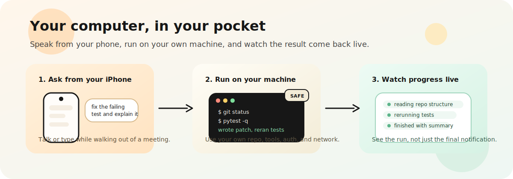

# MOBaiLE

<p align="center">
  
</p>

<p align="center"><strong>Your own computer, in your pocket.</strong></p>

<p align="center">
  MOBaiLE is a handheld agent-control app for your own Mac or Linux computer.
  Start work from your iPhone, run on your files and tools, and watch the execution stream back live.
</p>

<p align="center">
  This repo ships both the iPhone app and the paired backend. Build from <code>ios/</code> while developing, or use TestFlight/App Store for signed releases.
</p>

<p align="center">
  <a href="docs/USAGE.md"><strong>Usage</strong></a>
  ·
  <a href="backend/README.md"><strong>Backend</strong></a>
  ·
  <a href="ios/README.md"><strong>iPhone App</strong></a>
  ·
  <a href="scripts/README.md"><strong>Scripts</strong></a>
  ·
  <a href="docs/APP_STORE_COPY.md"><strong>App Store</strong></a>
</p>

<p align="center">
  
</p>

## Why MOBaiLE

MOBaiLE is for the moments when the work is real, but opening your laptop is the slowest part.

<table>
  <tr>
    <td width="33%" valign="top">
      <strong>Use your real machine</strong><br />
      Run against your actual repo, credentials, CLI tools, and network instead of a toy remote environment.
    </td>
    <td width="33%" valign="top">
      <strong>See progress live</strong><br />
      Follow planning, execution, and the final result from the phone instead of sending work into a black box.
    </td>
    <td width="33%" valign="top">
      <strong>Start safe, expand later</strong><br />
      Begin in <code>safe</code> mode, then unlock more power on trusted hosts with <code>full-access</code>.
    </td>
  </tr>
</table>

<table>
  <tr>
    <td width="33%" align="center" valign="top">
      
    </td>
    <td width="33%" align="center" valign="top">
      
    </td>
    <td width="33%" align="center" valign="top">
      
    </td>
  </tr>
  <tr>
    <td align="center" valign="top">
      <strong>Configured start</strong><br />
      Starter prompts and workspace context without extra setup noise.
    </td>
    <td align="center" valign="top">
      <strong>Active thread</strong><br />
      A working conversation with status, results, and the next ask in one place.
    </td>
    <td align="center" valign="top">
      <strong>Voice capture</strong><br />
      Record a task, keep attachments inline, and send without leaving the thread.
    </td>
  </tr>
</table>

## Try These First

- `create a hello python script and run it`
- `inspect this repo and tell me where onboarding feels rough`
- `check my calendar today and summarize conflicts`
- `fix the failing test and explain the patch`

## Quick Start

Choose the shortest path that matches how you want to use MOBaiLE.

### 0. What you need

- one Mac or Linux computer you control
- an iPhone with MOBaiLE installed
- the backend running on that computer
- Tailscale only if you want access away from your local network

### 1. Fastest local setup

If you already have `python3` on the computer that will run the backend:

```bash
bash ./scripts/install_backend.sh --mode safe
cd backend
bash ./run_backend.sh
curl http://127.0.0.1:8000/health
```

`install_backend.sh` installs `uv` for you if it is missing.

### 2. Managed install into `~/MOBaiLE`

If you want a no-clone bootstrap flow on a fresh host:

```bash
curl -fsSL https://raw.githubusercontent.com/vemundss/MOBaiLE/main/scripts/bootstrap_server.sh | bash -s -- --mode safe
```

`bootstrap_server.sh` installs into `~/MOBaiLE` by default, so use `install_backend.sh` when you want to work from this checkout.

### 3. Trusted private host with more autonomy

For a more autonomous server-side setup:

```bash
bash ./scripts/install_backend.sh --mode full-access --with-autonomy-stack
# or:
npm run setup:server:auto
```

If no Codex or Claude CLI is installed, MOBaiLE keeps the internal `local` executor available for smoke and development text requests.

### 4. Open the iOS app in simulator

```bash
cd ios
open VoiceAgentApp.xcodeproj
```

Run `xcodegen generate` only after editing `ios/project.yml` or if the checked-in Xcode project gets out of sync.

Need more detail? Jump to [`docs/USAGE.md`](docs/USAGE.md), [`docs/AUTONOMY_STACK.md`](docs/AUTONOMY_STACK.md), [`backend/README.md`](backend/README.md), [`ios/README.md`](ios/README.md), or [`scripts/README.md`](scripts/README.md).

## Pair Your iPhone Over Tailscale

This is the recommended path when you want to use MOBaiLE away from your desk.

1. Install Tailscale on both your computer and iPhone.
2. Bootstrap the backend on the computer.
3. Scan the pairing QR from the phone.
4. Turn off Wi-Fi on the phone once and confirm a prompt works over cellular.

<details>
  <summary><strong>Full end-to-end setup</strong></summary>

### Install required apps and tools

On your computer:

- `git`, `python3`, `curl`
- [`uv`](https://docs.astral.sh/uv/) (auto-installed by `install_backend.sh` and `bootstrap_server.sh` if missing)
- [Tailscale](https://tailscale.com/download)

On your iPhone:

- **Tailscale**
- **MOBaiLE**
  - install from TestFlight or App Store if distributed
  - or build from `ios/` in Xcode if you are developing locally

MOBaiLE never runs your code on the phone. The iPhone app only sends prompts, voice, attachments, and metadata to the backend you pair with.

### Sign in to Tailscale on both devices

Use the same Tailscale account and tailnet on both devices.

On the computer, verify Tailscale is connected:

```bash
tailscale status
tailscale ip -4
```

### Install and bootstrap the backend

Option A, one command into `~/MOBaiLE`:

```bash
curl -fsSL https://raw.githubusercontent.com/vemundss/MOBaiLE/main/scripts/bootstrap_server.sh | bash -s -- --mode safe
```

Option B, manual flow from a checkout:

```bash
git clone https://github.com/vemundss/MOBaiLE.git
cd MOBaiLE
bash ./scripts/install_backend.sh --mode safe --expose-network
bash ./scripts/service_macos.sh install   # macOS
# or on Linux:
bash ./scripts/service_linux.sh install
bash ./scripts/doctor.sh
bash ./scripts/pairing_qr.sh
```

What bootstrap does:

- clones or updates the repo into `~/MOBaiLE`
- installs backend dependencies and creates `backend/.env`
- creates `backend/pairing.json` using a Tailscale URL when available
- installs and starts a background service on macOS or Linux when supported
- generates `backend/pairing-qr.png`

If you want a stable URL for the iPhone to use, set `VOICE_AGENT_PUBLIC_SERVER_URL` before pairing. Otherwise MOBaiLE prefers a Tailscale or LAN address from `backend/pairing.json`.

### Verify backend health

```bash
curl http://127.0.0.1:8000/health
```

Expected result: JSON with status `ok`.

### Pair the phone

On the computer:

1. Open `backend/pairing-qr.png`.
2. If it is missing, regenerate it:

```bash
bash ./scripts/pairing_qr.sh
```

On the iPhone:

1. Open Camera and scan the QR.
2. Tap the `mobaile://pair...` deep link.
3. Confirm the pairing inside MOBaiLE.

Manual fallback inside MOBaiLE settings:

1. `Server URL`: Tailscale URL from `backend/pairing.json`
2. `API Token`: `VOICE_AGENT_API_TOKEN` from `backend/.env`
3. `Session ID`: default `iphone-app` is fine

If the app cannot connect on cellular, check that the backend was installed with `--expose-network` or that your chosen Tailscale/public URL is reachable from the iPhone.

### Validate remote access over cellular

1. Turn off Wi-Fi on the iPhone.
2. Keep Tailscale connected.
3. Run a small prompt, for example `create and run a hello script`.
4. Confirm you see live run events and the final result.

</details>

## Built For Away-From-Desk Work

- **Widget:** add the `Start Voice Task` widget to launch straight into recording.
- **Haptic and audio cues:** enable them in `Settings` to confirm start, success, and failure without staring at the screen.
- **Auto-send after silence:** hands-free mode that submits when you stop speaking.
- **Siri and Shortcuts:** available intents include `Start Voice Task` and `Send Last Prompt`.

## Developer Commands

Common maintenance commands:

```bash
bash ./scripts/doctor.sh
bash ./scripts/pairing_qr.sh
cd backend && bash ./run_backend.sh
cd backend && uv run pytest -q
cd backend && uv run python ../scripts/sync_contracts.py --check
```

Service control:

```bash
# macOS
bash ./scripts/service_macos.sh status
bash ./scripts/service_macos.sh restart
bash ./scripts/service_macos.sh logs

# Linux
bash ./scripts/service_linux.sh status
bash ./scripts/service_linux.sh restart
bash ./scripts/service_linux.sh logs
```

Optional npm wrappers:

```bash
npm run setup:server
npm run backend:start
npm run doctor
npm run pair:qr
npm run ios:open
```

Optional commit-time secret scanning:

```bash
uv tool install pre-commit
pre-commit install
pre-commit run --all-files
```

## Troubleshooting

<details>
  <summary><strong>Common fixes</strong></summary>

- Pairing QR contains `127.0.0.1` instead of a Tailscale URL:

```bash
bash ./scripts/install_backend.sh --mode safe --expose-network
bash ./scripts/pairing_qr.sh
```

- iPhone can pair on Wi-Fi but not on cellular:
  - confirm Tailscale is connected on both devices
  - confirm the backend is still running with `bash ./scripts/doctor.sh`

- Voice works for text but not the mic:
  - enable `Speech Recognition` for MOBaiLE in iOS Settings
  - on a real iPhone, MOBaiLE transcribes locally first, and `OPENAI_API_KEY` is only needed for backend audio upload fallback

- Backend audio uploads fail:
  - set `OPENAI_API_KEY` in `backend/.env`
  - text prompts still work without it, but `/v1/audio` depends on backend transcription

</details>

## More Docs

- Usage guide: [`docs/USAGE.md`](docs/USAGE.md)
- Backend details and endpoints: [`backend/README.md`](backend/README.md)
- iOS details: [`ios/README.md`](ios/README.md)
- Scripts reference: [`scripts/README.md`](scripts/README.md)
- Architecture: [`ARCHITECTURE.md`](ARCHITECTURE.md)
- Documentation policy: [`docs/POLICY.md`](docs/POLICY.md)
- Contributing: [`CONTRIBUTING.md`](CONTRIBUTING.md)
- Security policy: [`SECURITY.md`](SECURITY.md)
- Code of conduct: [`CODE_OF_CONDUCT.md`](CODE_OF_CONDUCT.md)

## Publishing And Privacy

Apple requires a public privacy policy URL for App Store submissions.

Repo source of truth:

- `docs/index.html`
- `docs/privacy-policy.html`
- `docs/support.html`

GitHub Pages deploy workflow:

- `.github/workflows/deploy-privacy-policy.yml`

Expected public URLs after Pages is enabled:

- Site: `https://vemundss.github.io/MOBaiLE/`
- Privacy policy: `https://vemundss.github.io/MOBaiLE/privacy-policy.html`
- Support: `https://vemundss.github.io/MOBaiLE/support.html`

Activation steps:

1. Push `main` to GitHub.
2. In GitHub repository settings, enable Pages and select `GitHub Actions` as the source.
3. Wait for the `Deploy Public Pages` workflow to complete.
4. Use the GitHub Pages URLs in App Store Connect and inside the app once they are live.
5. If you rename the repo or move it to another owner, update the URLs accordingly.

## License

This project is licensed under the Apache License, Version 2.0.
See [`LICENSE`](LICENSE) for the full text.
