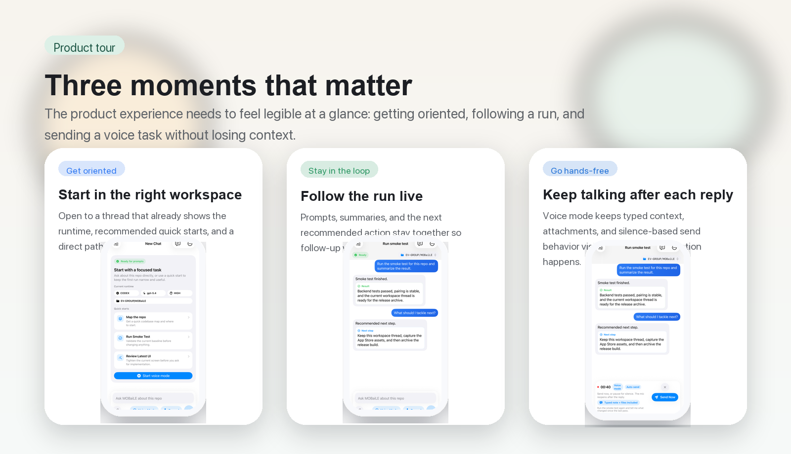

# MOBaiLE

<p align="center">
  
</p>

<p align="center"><strong>Handheld control for your own Mac or Linux machine.</strong></p>

<p align="center">
  Start a task from your iPhone, run it on your own computer, and keep the whole thread visible while you are away from the keyboard.
</p>

<p align="center">
  Use the iPhone app to control your own machine. This repo contains both the phone app and the computer-side setup if you want to build or self-host it.
</p>

<p align="center">
  <a href="docs/USAGE.md"><strong>Usage</strong></a>
  ·
  <a href="backend/README.md"><strong>Backend</strong></a>
  ·
  <a href="ios/README.md"><strong>iPhone App</strong></a>
  ·
  <a href="ARCHITECTURE.md"><strong>Architecture</strong></a>
  ·
  <a href="scripts/README.md"><strong>Scripts</strong></a>
</p>

<p align="center">
  
</p>

> MOBaiLE is the phone app. Your Mac or Linux machine does the work.

Copy this on the computer you want MOBaiLE to use:

```bash
curl -fsSL https://raw.githubusercontent.com/vemundss/MOBaiLE/main/scripts/install.sh | bash
```

## Quick Start

If you just want it working, start here.

1. Paste the install command on the Mac or Linux machine you want to control.
2. Keep the default answers unless you know you want something else.
   Those defaults mean: use your normal tools and files, let the phone reach that machine when you are away from home, and keep MOBaiLE ready after you close the terminal.
3. When the installer shows the pairing QR, open MOBaiLE on your iPhone and tap `Scan Pairing QR`.
4. Point the phone at the screen and confirm the pairing.
5. Later, run `mobaile status` any time to check that the computer is ready. If your shell does not find it yet, run `~/.local/bin/mobaile status`.

When you want the latest CLI/backend updates later, run `mobaile update`.

What the installer does for you:

- installs or updates MOBaiLE in `~/MOBaiLE`
- gets that computer ready
- keeps it running in the background when supported
- creates the pairing QR
- installs the `mobaile` command for status, pairing, and logs

Need more detail? See [`docs/USAGE.md`](docs/USAGE.md), [`ios/README.md`](ios/README.md), [`backend/README.md`](backend/README.md), and [`scripts/README.md`](scripts/README.md).

## Why It Feels Different

- **Runs against your real machine.** Use your actual repo, CLI tools, auth, files, and network instead of a toy remote environment.
- **Keeps the run legible.** Planning, execution, summaries, and follow-up all stay in one thread instead of collapsing into a final notification.
- **Works away from the desk.** Voice input, auto-send after silence, widgets, haptics, audio cues, and Shortcuts make it usable when your laptop is the inconvenient device.
- **Lets you choose the trust level.** Use `Safe` on a cautious host, or `Full Access` on a trusted private machine.

## What The Product Looks Like

<p align="center">
  
</p>

## Good First Prompts

- `create a hello python script and run it`
- `inspect this repo and tell me where onboarding feels rough`
- `check my calendar today and summarize conflicts`
- `fix the failing test and explain the patch`

<details>
  <summary><strong>Other setup paths</strong></summary>

Use these only if the main install command is not what you want.

- Already in a checkout and want to run the installer there: `bash ./scripts/install.sh`
- Backend-only/manual path from a checkout: `bash ./scripts/install_backend.sh --mode full-access --phone-access tailscale`
- Local simulator-only testing: `bash ./scripts/install_backend.sh --mode safe --phone-access local`

If you skip QR pairing, the app can also be connected manually with a reachable server address and API token.

</details>

<details>
  <summary><strong>Full setup details</strong></summary>

### Install the essentials

On your computer:

- `git`, `python3`, `curl`
- [`uv`](https://docs.astral.sh/uv/) if you are not letting the install scripts add it for you
- [Tailscale](https://tailscale.com/download)

On your iPhone:

- **Tailscale**
- **MOBaiLE**, from TestFlight or the App Store, or built locally from `ios/`

MOBaiLE never runs code on the phone. It only sends prompts, audio, attachments, and session metadata to the backend you pair with.

### Sign in to Tailscale on both devices

Use the same tailnet on both devices. On the computer:

```bash
tailscale status
tailscale ip -4
```

### Install on the computer

Recommended path:

```bash
curl -fsSL https://raw.githubusercontent.com/vemundss/MOBaiLE/main/scripts/install.sh | bash
```

If you are already in a checkout:

```bash
bash ./scripts/install.sh --checkout "$PWD"
```

The installer asks three questions:

1. How much access should MOBaiLE have on this computer?
   Keep `Full Access` unless you specifically want the safer mode.
2. Where should your phone work?
   Keep `Anywhere with Tailscale` for the normal remote setup.
3. Should MOBaiLE stay running in the background?
   Keep `Yes` if this computer should stay ready for the phone.

Manual host-only path from a checkout:

```bash
bash ./scripts/install_backend.sh --mode full-access --phone-access tailscale
bash ./scripts/service_macos.sh install   # macOS
# or on Linux:
bash ./scripts/service_linux.sh install
bash ./scripts/pairing_qr.sh
```

What the installer does:

- installs backend dependencies and creates `backend/.env`
- creates `backend/pairing.json` using a Tailscale URL when available
- installs and starts a background service on macOS or Linux when supported
- generates `backend/pairing-qr.png`

If you want a stable hostname for the iPhone, set `VOICE_AGENT_PUBLIC_SERVER_URL` before pairing. Otherwise MOBaiLE prefers the Tailscale or LAN URLs advertised in `backend/pairing.json`.

### Check that the computer is ready

```bash
curl http://127.0.0.1:8000/health
```

Expected result: JSON with status `ok`.

### Pair the phone

On the computer:

1. Open `backend/pairing-qr.png`.
2. If it is missing, regenerate it:

```bash
bash ./scripts/pairing_qr.sh
```

On the iPhone:

1. Tap `Scan Pairing QR` inside MOBaiLE.
2. Point the phone at the QR on your computer.
3. Confirm pairing inside MOBaiLE.

Manual fallback in app settings:

- `Server URL`: preferred URL from `backend/pairing.json`
- `API Token`: `VOICE_AGENT_API_TOKEN` from `backend/.env`
- `Session ID`: keep `iphone-app` unless you want a custom one

If the app works on Wi-Fi but not on cellular, verify the chosen Tailscale or public URL is reachable from the phone.

### Validate remote use

1. Turn off Wi-Fi on the iPhone.
2. Keep Tailscale connected.
3. Send a small prompt such as `create and run a hello script`.
4. Confirm live events and the final result both come back in the thread.

</details>

## Designed For On-The-Go Use

- **Widget:** add `Start Voice Task` to jump straight into recording from the Home Screen.
- **Haptic and audio cues:** useful when you do not want to stare at the screen for confirmation.
- **Voice mode:** keeps the mic reopening after each reply so the conversation can continue hands-free.
- **Auto-send after silence:** ideal for shorter one-shot voice captures.
- **Siri and Shortcuts:** available intents include `Start Voice Mode` and `Send Last Prompt`.

## Developer Commands

Common maintenance commands:

```bash
bash ./scripts/doctor.sh
bash ./scripts/pairing_qr.sh
cd backend && bash ./run_backend.sh
cd backend && uv run pytest -q
cd backend && uv run python ../scripts/sync_contracts.py --check
```

Service control:

```bash
# macOS
bash ./scripts/service_macos.sh status
bash ./scripts/service_macos.sh restart
bash ./scripts/service_macos.sh logs

# Linux
bash ./scripts/service_linux.sh status
bash ./scripts/service_linux.sh restart
bash ./scripts/service_linux.sh logs
```

Optional npm wrappers:

```bash
npm run setup:server
npm run backend:start
npm run doctor
npm run pair:qr
npm run ios:open
```

Optional commit-time secret scanning:

```bash
uv tool install pre-commit
pre-commit install
pre-commit run --all-files
```

## Troubleshooting

<details>
  <summary><strong>Common fixes</strong></summary>

- Pairing QR contains `127.0.0.1` instead of a Tailscale or LAN URL:

```bash
bash ./scripts/install_backend.sh --mode full-access --phone-access tailscale
bash ./scripts/pairing_qr.sh
```

- iPhone can pair on Wi-Fi but not on cellular:
  - confirm Tailscale is connected on both devices
  - confirm the backend is still running with `bash ./scripts/doctor.sh`

- Voice works for text but not the mic:
  - enable `Speech Recognition` for MOBaiLE in iOS Settings
  - on a real iPhone, MOBaiLE transcribes locally first, and `OPENAI_API_KEY` is only needed for backend audio-upload fallback

- Backend audio uploads fail:
  - set `OPENAI_API_KEY` in `backend/.env`
  - text prompts still work without it, but `/v1/audio` depends on backend transcription

</details>

## More Docs

- Usage guide: [`docs/USAGE.md`](docs/USAGE.md)
- Backend details and endpoints: [`backend/README.md`](backend/README.md)
- iPhone details: [`ios/README.md`](ios/README.md)
- Scripts reference: [`scripts/README.md`](scripts/README.md)
- Architecture: [`ARCHITECTURE.md`](ARCHITECTURE.md)
- Documentation policy: [`docs/POLICY.md`](docs/POLICY.md)
- Public pages and App Store URLs: [`docs/PUBLIC_PAGES.md`](docs/PUBLIC_PAGES.md)
- App Store copy: [`docs/APP_STORE_COPY.md`](docs/APP_STORE_COPY.md)
- Contributing: [`CONTRIBUTING.md`](CONTRIBUTING.md)
- Security policy: [`SECURITY.md`](SECURITY.md)
- Code of conduct: [`CODE_OF_CONDUCT.md`](CODE_OF_CONDUCT.md)

## License

This project is licensed under the Apache License, Version 2.0.
See [`LICENSE`](LICENSE) for the full text.
