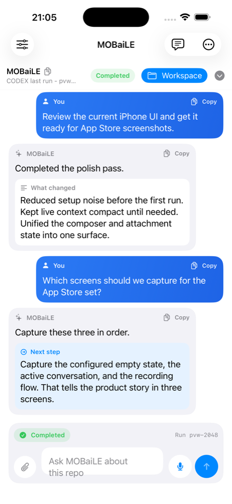

# iPhone App

<p align="center">
  
</p>

MOBaiLE on iPhone is the handheld control surface for your own Mac or Linux machine.
You open the app, pair it with your computer, send text or voice requests, and keep the run legible without going back to your laptop.

The app does not execute code on the phone. It forwards your prompt, audio, attachments, and session context to the backend you control.

## Why It Feels Good On Phone

- Start from the same workspace thread you were already using
- Send a quick typed prompt or record a one-shot voice task
- Keep one thread in voice mode for a hands-free send-reply-listen loop
- Watch progress, results, and the next recommended step in the same conversation
- Reuse the same runtime, working directory, and context across runs

You do not need to understand agents, Xcode, or backend internals to use the app once it is paired.

## What Runs Where

- **Phone:** prompt capture, voice capture, local thread history, haptics, widgets, and Shortcuts
- **Paired host:** actual execution, files, shell tools, auth, network access, and run orchestration
- **Trust boundary:** the app sends prompts, audio, attachments, and session metadata to the backend you configure; it does not run code locally on the iPhone

## Fastest Setup

This is the shortest path:

1. On the computer you want MOBaiLE to use, run:

```bash
curl -fsSL https://raw.githubusercontent.com/vemundss/MOBaiLE/main/scripts/install.sh | bash
```

2. Keep the default answers in the installer:
   `Full Access`, `Anywhere with Tailscale`, and usually `Yes` for the background service.
3. Run `mobaile pair` on that computer. If your shell does not find it yet, run `~/.local/bin/mobaile pair`.
4. Open the `Pairing QR` path it prints.
5. In MOBaiLE, tap `Scan Pairing QR` and point the phone at the screen.
6. If you scan it with Camera instead, open the `mobaile://pair...` link it detects.
7. Confirm the pairing inside MOBaiLE and send a small prompt.
8. Later, run `mobaile status` on the computer if you want to check the connection. If your shell does not find it yet, run `~/.local/bin/mobaile status`.

Already inside this repo? Run:

```bash
bash ./scripts/install.sh
```

Manual fallback inside app Settings:

1. Set `Server URL` to the value from the active pairing file
2. Set `API Token` to `VOICE_AGENT_API_TOKEN` from the active backend `.env`
3. Keep `Session ID` as `iphone-app` unless you want a custom one

Important:

- if you are using a real iPhone, `127.0.0.1` will not work
- use the preferred URL from the active pairing file; MOBaiLE will also keep any fallback LAN/Tailscale URLs advertised there
- when Tailscale MagicDNS is enabled, pairing prefers the stable `*.ts.net` hostname before raw Tailscale IPs
- the app asks for microphone and Speech Recognition permission
- if you have a stable remote hostname, set `VOICE_AGENT_PUBLIC_SERVER_URL` on the backend so pairing prefers that URL

## Good First Actions

- `create a hello python script and run it`
- `inspect this repo and tell me where onboarding feels rough`
- `summarize what changed in this project today`
- `review this thread and tell me the next thing I should do`

## If You Are Building It From This Repo

### Fastest path: simulator first

From repo root:

```bash
cd ios
open VoiceAgentApp.xcodeproj
```

In Xcode:

1. Select scheme `VoiceAgentApp`
2. Choose a simulator such as `iPhone 17`
3. Press Run

Starting on Simulator is the least-friction path because it avoids signing and device trust issues.

If you changed `ios/project.yml`, run `xcodegen generate` first.

### Real iPhone install

If you want to run the app on your own iPhone, expect one-time signing setup:

1. Open target `VoiceAgentApp` -> `Signing & Capabilities`
2. Select your Apple development team
3. Repeat for `VoiceTaskWidgetExtension`
4. If Xcode reports bundle identifier conflicts, change them to unique values under your team
5. Rebuild for your phone

The checked-in project does not hard-code a development team, so Xcode should let you choose your own signing team cleanly.

## Features Worth Turning On

- **Widget:** add `Resume Voice Mode` to reopen the active or last voice thread hands-free
- **Haptic and audio cues:** helpful when you are using the app while walking or multitasking
- **Auto-send after silence:** useful for one-shot voice capture without turning on persistent voice mode
- **Siri and Shortcuts:** `Resume Voice Mode` returns to the active or last voice thread, while `Start New Voice Thread` creates a fresh thread and starts voice mode there

## Voice Interaction Model

- The mic button in the composer can be used two ways:
  - one-shot recording records a single prompt and sends it once
  - voice mode is persistent and thread-bound, so that thread keeps listening again after each reply
- Switching to another thread ends voice mode on the previous thread instead of silently carrying it across conversations.
- Shortcuts follow the same split:
  - `Resume Voice Mode` reopens the current or most recent voice-mode thread
  - `Start New Voice Thread` creates a new thread and starts voice mode there

## Fast Fixes

- App on real iPhone cannot reach backend:
  - do not use `127.0.0.1`
  - use a LAN or Tailscale URL
  - run `mobaile status` on the computer, or `~/.local/bin/mobaile status` if needed, and confirm the pairing URL looks right

- Real iPhone shows `App Transport Security requires the use of a secure connection`:
  - Debug builds allow plain `http://` backend URLs
  - Release-style builds allow plain `http://` for local network addresses and `*.ts.net` Tailscale MagicDNS hosts
  - Other remote hosts still require `https://` unless you add a matching ATS exception

- Pairing link opens but app does not connect:
  - verify the backend is running
  - run `mobaile pair` and use the fresh QR path it prints
  - verify the pair code and session in the active pairing file are current, not an old checkout copy
  - check whether the active pairing file lists multiple `server_urls`; the app will try them in order and promote the one that works
  - verify `VOICE_AGENT_API_TOKEN` in the active backend `.env` matches the running backend
  - if pairing fails immediately, rotate the pairing file first with `bash ./scripts/rotate_api_token.sh`

- Audio fails but text works:
  - enable `Speech Recognition` for MOBaiLE in iOS Settings
  - if you are on Simulator or local speech is unavailable, configure backend `OPENAI_API_KEY` for audio-upload fallback

If you are just pairing the app, you should not need to touch Xcode after the first install. Most connection issues come from the backend URL, token, or network path rather than the iPhone app itself.

## Developer Notes

- `ios/VoiceAgentApp.xcodeproj` is checked in
- `ios/project.yml` is the xcodegen source
- app code lives in `ios/VoiceAgentApp/`
- tests live in `ios/VoiceAgentAppTests/`
- local speech recognition is attempted first on real iPhone, with backend `/v1/audio` as fallback when configured
- run logs are available in-app through the logs screen

## Test Command

From `ios/`:

```bash
xcodebuild -project VoiceAgentApp.xcodeproj -scheme VoiceAgentApp -destination 'platform=iOS Simulator,name=iPhone 17' test
```

If `iPhone 17` is not available on your Xcode version, replace it with any available iPhone simulator from `xcrun simctl list devices available`.

For App Store release prep, see [`docs/APP_STORE_SUBMISSION.md`](../docs/APP_STORE_SUBMISSION.md).
